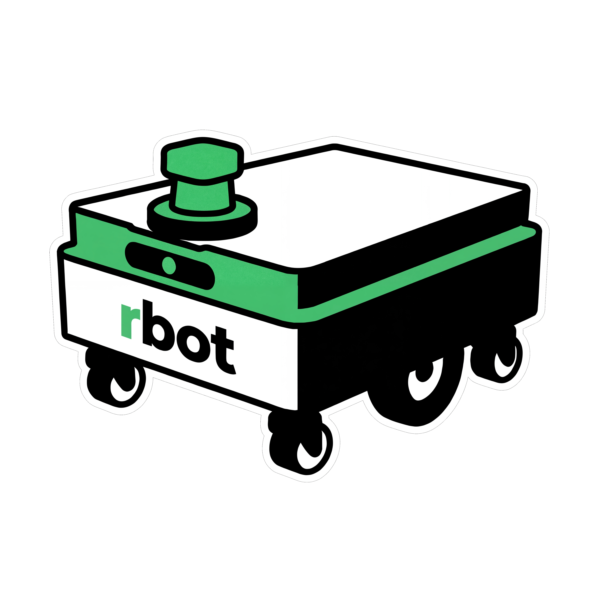

<p align="center">
  
</p>

<h1 align="center">rbot</h1>

<p align="center">
  An open-source Autonomous Mobile Robot simulation stack for ROS 2 Jazzy and Gazebo Harmonic.
</p>

<p align="center">
  <a href="LICENSE"></a>
  
  
  
</p>

---

## Overview

`rbot` is a complete simulation-first Autonomous Mobile Robot (AMR) stack. It brings together robot description, Gazebo simulation, `ros2_control`, teleoperation, perception, localization, mapping, and Nav2 navigation in a modular ROS 2 workspace.

The project is designed for two audiences:

- **ROS users** who want a practical AMR reference stack they can run, inspect, and extend.
- **Learners** who want a clear path through the main building blocks of a modern mobile robot system.

The primary simulator is **Gazebo Harmonic**. Isaac Sim integration is coming soon (open for PRs).

---

## What You Can Do

- Launch a differential-drive AMR in Gazebo Harmonic.
- Inspect and modify the robot URDF/Xacro model, meshes, sensors, and payload deck.
- Run `ros2_control` with a differential-drive controller and joint state broadcaster.
- Use joystick teleoperation with a software e-stop node.
- Simulate 2-D LiDAR, IMU, depth camera, stereo camera, GPS, and optional 3-D LiDAR bridges.
- Run EKF localization, AMCL, SLAM Toolbox mapping, and Nav2 navigation.
- Use Docker for a reproducible development and simulation environment.

---

## Three Magic Commands

Use these commands for mapping and then autonomous navigation loop.

Prerequisites: Docker with Compose support. For RViz on Linux, make sure X11 forwarding is available.

1. Start mapping with RViz:

   ```bash
   bash scripts/run_sim.sh --headless --rviz-mapping
   ```

   - Drive the robot through the map with teleop (next command).
   - See [Run mapping with SLAM Toolbox](#run-mapping-with-slam-toolbox) for how to save the map.

2. Start teleop:

   ```bash
   docker compose -f docker/docker-compose.yml run --rm teleop
   ```

   - Use the joystick or keyboard controls to cover open aisles, corners, and doorways.

3. Start navigation with RViz:

   ```bash
   bash scripts/run_sim.sh --headless --rviz-nav --map /ros2_ws/maps/my_map.yaml
   ```

   - In RViz2, use **Set Initial Pose** from the top panel to align AMCL with the robot.
   - Use **Nav2 Goal** from the top panel to send the robot to a target pose.

---

## Stack

| Layer | Technology |
| --- | --- |
| OS target | Ubuntu 24.04 LTS |
| ROS distribution | ROS 2 Jazzy Jalisco |
| Primary simulator | Gazebo Harmonic |
| Middleware | CycloneDDS |
| Robot model | URDF/Xacro + generated mesh assets |
| Control | `ros2_control`, `diff_drive_controller`, `joint_state_broadcaster` |
| Teleoperation | `joy_linux`, `teleop_twist_joy`, software e-stop |
| Perception | 2-D LiDAR, optional 3-D point-cloud filtering, stereo/depth processing |
| Localization | `robot_localization` EKF, AMCL |
| Mapping | SLAM Toolbox online async and lifelong configs |
| Navigation | Nav2 with MPPI controller and SMAC Hybrid-A* planner |
| Containers | Docker, Docker Compose, VS Code Dev Container |

---

## Repository Layout

```text
rbot/
├── .devcontainer/        # VS Code Dev Container setup
├── .github/workflows/    # CI build, lint, and test workflow
├── docker/               # Dockerfiles, compose services, entrypoint
├── docs/                 # Architecture notes, sensor docs, tutorials
├── maps/                 # Example occupancy maps and metadata
├── scripts/              # Build, dependency, simulation, and mesh helpers
└── src/
    ├── bringup/          # Top-level simulation launch orchestration
    ├── control/          # ros2_control and teleoperation packages
    ├── localization/     # EKF and AMCL launch/config packages
    ├── mapping/          # SLAM Toolbox launch/config packages
    ├── navigation/       # Nav2 launch, params, behavior trees, client
    ├── perception/       # LiDAR and camera processing packages
    ├── robot/            # Robot description and mesh packages
    ├── simulation/       # Gazebo and Isaac package scaffolding
    └── utils/            # Shared utility package placeholder
```

---

## Quick Start: Docker

Docker is the recommended path for first-time users because it keeps ROS, Gazebo, and system dependencies isolated.

### 1. Install host requirements

Install Docker with Compose support. For GUI simulation on Linux, make sure X11 forwarding is available.

### 2. Build and run the Gazebo stack

```bash
bash scripts/run_sim.sh
```

Useful variants:

```bash
bash scripts/run_sim.sh --headless
bash scripts/run_sim.sh --rviz
bash scripts/run_sim.sh --rviz-nav
bash scripts/run_sim.sh --headless --rviz-nav --map /ros2_ws/maps/my_map.yaml
bash scripts/run_sim.sh --headless --rviz-mapping
```

The script starts services from `docker/docker-compose.yml` and launches the simulation stack inside the container. Use `--map` with `--rviz-nav` when AMCL/Nav2 should localize against a specific map YAML mounted under `/ros2_ws/maps/`.

### 3. Alternative Docker helper

```bash
zsh scripts/sim_docker.sh
zsh scripts/sim_docker.sh --headless
zsh scripts/sim_docker.sh --shell
zsh scripts/sim_docker.sh world:=large_warehouse
```

Use this helper when you want direct `docker run` style control or an interactive shell in the simulation image.

---

## Quick Start: Native Ubuntu 24.04

Native setup is useful when you already work in a ROS 2 Jazzy environment.

```bash
bash scripts/install_deps.sh
bash scripts/build.sh
source install/setup.bash
ros2 launch rlai_bringup simulation.launch.py
```

To launch a specific world:

```bash
ros2 launch rlai_bringup simulation.launch.py world:=small_warehouse
```

Headless Gazebo:

```bash
ros2 launch rlai_bringup simulation.launch.py headless:=true
```

---

## Common Workflows

### Launch simulation with default localization

```bash
ros2 launch rlai_bringup simulation.launch.py localization_enabled:=true
```

This starts Gazebo, robot description publishing, ros2_control, and EKF localization.

### Enable joystick teleoperation

```bash
ros2 launch rlai_bringup simulation.launch.py teleop_enabled:=true
```

The joystick configuration lives in:

```text
src/control/rlai_teleop/config/joystick.yaml
```

The software e-stop service is available at:

```bash
ros2 service call /e_stop std_srvs/srv/Trigger {}
```

### Run mapping with SLAM Toolbox

```bash
ros2 launch rlai_bringup simulation.launch.py \
  mapping_enabled:=true \
  slam_rviz_enabled:=true
```

Save the map from the mapping container when coverage looks good:

```bash
docker exec -it rlai_sim_mapping ros2 run nav2_map_server map_saver_cli -f /ros2_ws/maps/my_map
```

Do not enable `mapping_enabled:=true` and `use_amcl:=true` at the same time. Both publish `map -> odom`.

### Run AMCL with a saved map

```bash
ros2 launch rlai_bringup simulation.launch.py \
  use_amcl:=true \
  map_yaml_file:=/absolute/path/to/map.yaml
```

Example maps are stored in `maps/`.

### Launch Docker navigation with a saved map

```bash
bash scripts/run_sim.sh --headless --rviz-nav --map /ros2_ws/maps/my_map.yaml
```

The host `maps/` directory is mounted read-only at `/ros2_ws/maps/` in the navigation container, so pass the container path to the YAML file.

### Launch Nav2 directly

```bash
ros2 launch rlai_navigation navigation.launch.py \
  map:=/absolute/path/to/map.yaml
```

Use this when localization is already running and you want to focus on Nav2 behavior.

### Send a navigation goal programmatically

```bash
ros2 run rlai_navigation nav_client --ros-args \
  -p x:=3.0 \
  -p y:=2.0 \
  -p yaw:=0.0
```

Patrol mode:

```bash
ros2 run rlai_navigation nav_client --ros-args -p mode:=patrol
```

---

## Package Index

| Package | Type | Purpose |
| --- | --- | --- |
| `rlai_description` | `ament_cmake` | Robot URDF/Xacro, sensor mounts, payload platform, RViz configs |
| `rlai_meshes` | `ament_cmake` | Mesh assets used by the robot description |
| `rlai_gazebo` | `ament_cmake` | Gazebo worlds, launch files, ROS-Gazebo bridge config |
| `rlai_isaac` | `ament_python` | Placeholder package for future Isaac Sim integration |
| `rlai_control` | `ament_cmake` | `ros2_control` controller configuration and launch |
| `rlai_teleop` | `ament_python` | Joystick teleoperation and software e-stop node |
| `rlai_lidar_processing` | `ament_cmake` | Optional 3-D point-cloud height filtering and voxel downsampling |
| `rlai_camera_processing` | `ament_cmake` | Stereo disparity and depth point-cloud processing launch/config |
| `rlai_localization` | `ament_python` | IMU filtering, EKF, and AMCL launch/config |
| `rlai_mapping` | `ament_python` | SLAM Toolbox mapping and map-server launch/config |
| `rlai_navigation` | `ament_python` | Nav2 parameters, behavior trees, launch, and action client |
| `rlai_bringup` | `ament_python` | Top-level simulation bringup and stack orchestration |
| `rlai_utils` | `ament_python` | Shared utility package scaffold |

---

## Architecture Notes

### TF ownership

The stack uses a standard mobile robot TF chain:

```text
map -> odom -> base_footprint -> base_link -> sensor frames
```

Ownership is intentionally split:

- EKF publishes `odom -> base_footprint`.
- AMCL or SLAM Toolbox publishes `map -> odom`.
- Robot State Publisher publishes `base_footprint -> base_link` and sensor frames.

Avoid enabling multiple nodes that publish the same transform.

### Command velocity path

```text
teleop / Nav2 -> /cmd_vel -> velocity_smoother -> /diff_drive_controller/cmd_vel
```

The stack uses `TwistStamped` commands because the Jazzy `diff_drive_controller` expects stamped velocity input.

### Simulation bridge

Gazebo topics are bridged through:

```text
src/simulation/rlai_gazebo/config/ros_gz_bridge.yaml
```

`/joint_states` is intentionally not bridged because `joint_state_broadcaster` owns that ROS topic.

---

## Development

### Build

```bash
bash scripts/build.sh
```

Or manually:

```bash
source /opt/ros/jazzy/setup.bash
colcon build --symlink-install --cmake-args -DCMAKE_BUILD_TYPE=Release
```

### Test

```bash
source install/setup.bash
colcon test --event-handlers console_cohesion+ --return-code-on-test-failure
colcon test-result --verbose
```

### Lint Python packages

```bash
flake8 src --max-line-length=100 --extend-ignore=E203 --exclude=__pycache__
```

### Validate launch-file syntax quickly

```bash
python3 -m compileall -q src scripts
```

---

## Troubleshooting

### Gazebo GUI does not open from Docker

Allow local Docker containers to connect to your X server:

```bash
xhost +local:docker
```

Then rerun the simulation script.

### ROS commands cannot find packages

Source the workspace after building:

```bash
source install/setup.bash
```

If using Docker, open a shell in the built container and source the installed workspace there.

### Nav2 or AMCL cannot configure

Check that a valid map file was provided when `use_amcl:=true`:

```bash
ros2 launch rlai_bringup simulation.launch.py \
  use_amcl:=true \
  map_yaml_file:=/absolute/path/to/map.yaml
```

### TF conflicts or unstable localization

Make sure only one component publishes each transform:

- EKF: `odom -> base_footprint`
- AMCL or SLAM Toolbox: `map -> odom`
- Robot State Publisher: robot links and sensor frames

Do not run AMCL and SLAM mapping together unless you intentionally change TF ownership.

### Docker build is slow

The Gazebo image installs ROS, Gazebo, Nav2, SLAM, perception, and control dependencies. The first build can take several minutes; later builds should reuse Docker layers.

---

## Roadmap

Current focus:

- Gazebo Harmonic simulation stack
- ROS 2 control and teleoperation
- Sensor simulation and bridging
- EKF, AMCL, SLAM Toolbox, and Nav2 integration
- Open-source documentation and reproducible developer workflow

Future extension points:

- Isaac Sim integration
- Expanded benchmarks and automated scenario tests
- Additional warehouse, outdoor, and mixed-layout environments
- More perception and autonomy examples

---

## Contributing

Contributions are welcome. Start with [`CONTRIBUTING.md`](CONTRIBUTING.md) for development workflow, coding standards, and pull request guidance.

Good first contributions include:

- Improving setup instructions or troubleshooting notes.
- Adding reproducible simulation scenarios.
- Tuning navigation, localization, or mapping configs with before/after evidence.
- Adding tests or validation scripts for launch files, URDF/Xacro, and Gazebo worlds.

---

## License

This project is licensed under the [Apache License 2.0](LICENSE).

Copyright 2026 Robolabs AI (RLXAI ROBOLABSAI PRIVATE LIMITED).
