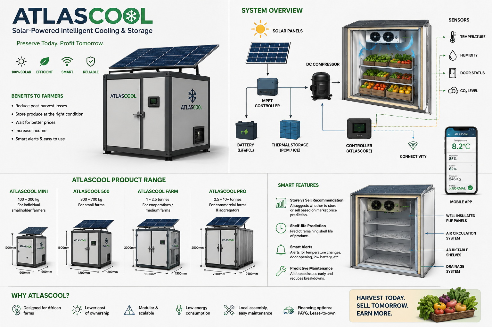

# PROJECT ATLAS

## A Two-Platform Autonomous Mobile Robot System for Warehouse Logistics

**Faraday's Lab**

<p align="center">
  
</p>

<p align="center">
  <strong>ROS 2 Jazzy · Gazebo Harmonic · Nav2 · Warehouse Autonomy</strong>
</p>

Project Atlas is an autonomous mobile robotics platform for warehouse logistics. It combines robot description, simulated sensors, perception interfaces, localization, mapping, navigation, path planning, obstacle avoidance, motion control, and warehouse environments in a modular ROS 2 workspace.

The repository is the **simulation and autonomy foundation** for two target platforms:

| Target platform | Target payload | Intended role | Current status |
|---|---:|---|---|
| **TITAN** | Approximately 60 kg | Small-load transport and warehouse material movement | Planned physical platform |
| **COLOSSUS** | Approximately 1,000 kg | Pallet and heavy-load transportation | Planned physical platform |

The current implementation provides a generic simulated mobile robot and the software interfaces needed to evolve toward both platforms. It does **not** claim that physical TITAN or COLOSSUS hardware is already implemented.

## Mission

Atlas is designed to make warehouse mobility more adaptable and reproducible. The autonomy stack separates hardware-facing interfaces from perception, localization, world representation, planning, and control so that the same engineering principles can support different robot sizes and warehouse layouts.

```text
Sensors → Perception → Localization → World Representation
                         ↓
              Global Planning → Local Planning
                         ↓
                    Motion Control → Robot
```

## Architecture

Atlas is organized as cooperating ROS 2 packages:

| Layer | Atlas packages | Responsibility |
|---|---|---|
| Robot description | `atlas_description`, `atlas_meshes` | URDF/Xacro, sensors, meshes, and robot model interfaces |
| Simulation | `atlas_gazebo`, `atlas_isaac` | Gazebo Harmonic worlds, models, bridges, and future simulator integration |
| Control | `atlas_control`, `atlas_teleop` | `ros2_control`, differential drive, velocity smoothing, teleoperation, and emergency stop |
| Perception | `atlas_lidar_processing`, `atlas_camera_processing` | LiDAR, camera, depth, stereo, and point-cloud processing interfaces |
| State estimation | `atlas_localization` | EKF, IMU filtering, AMCL, and localization launch workflows |
| Mapping | `atlas_mapping` | SLAM Toolbox and map-server workflows |
| Navigation | `atlas_navigation` | Nav2, global and local planning, behavior trees, recovery, and goal execution |
| Bringup | `atlas_bringup` | Top-level launch orchestration |
| Utilities | `atlas_utils` | Shared ROS 2 utilities and diagnostics |

### Autonomy pipeline

```text
2-D LiDAR / cameras / IMU / GPS
              ↓
         Perception
              ↓
     Localization and EKF
              ↓
       Map or world model
              ↓
       Nav2 global planner
              ↓
       Nav2 local controller
              ↓
       Velocity commands
              ↓
     ros2_control / Gazebo
              ↓
             Robot
```

The simulated sensor suite includes 2-D LiDAR, IMU, depth camera, stereo camera, GPS, and an optional 3-D LiDAR. These are simulation interfaces; physical sensor integration remains planned work.

## Warehouse simulation

Gazebo Harmonic is the primary simulation backend. The repository retains warehouse and benchmark worlds for testing robot spawning, sensor bridges, mapping, localization, navigation, obstacle avoidance, and recovery behavior.

The named benchmark environments are:

| Environment | Intended use |
|---|---|
| `benchmark_warehouse_easy` | Basic mapping and navigation validation |
| `benchmark_warehouse_medium` | Tighter aisles and increased clutter |
| `benchmark_warehouse_hard` | Tight turns, clutter, recovery behavior, and challenging navigation |
| `demo_warehouse_visual` | High-quality visualization and demonstrations |

See [`docs/benchmarks.md`](docs/benchmarks.md) for the evaluation plan. Results are not fabricated or included unless they have been measured by an automated experiment.

## Technology stack

| Area | Technology |
|---|---|
| Operating system | Ubuntu 24.04 LTS |
| Middleware | ROS 2 Jazzy |
| Simulation | Gazebo Harmonic |
| Navigation | Nav2 with MPPI and SMAC Hybrid-A* support |
| Mapping | SLAM Toolbox |
| Localization | AMCL, `robot_localization`, and IMU filtering |
| Control | `ros2_control` and differential-drive controllers |
| Description | URDF / Xacro |
| Visualization | RViz2 |
| Containers | Docker and Docker Compose |
| Languages | C++, Python, XML, and YAML |

## Repository structure

```text
Atlas-prototype/
├── .devcontainer/                 Development container configuration
├── .github/workflows/             Continuous integration
├── docker/                        Gazebo and development containers
├── docs/
│   ├── architecture/              Architecture documentation
│   ├── benchmarks.md              Benchmark definitions and metrics
│   ├── sensors/                   Sensor and evaluation documentation
│   └── tutorials/                 Gazebo and development tutorials
├── maps/                          Example occupancy maps
├── scripts/                       Build, dependency, and simulation helpers
├── src/
│   ├── bringup/                   Top-level launch orchestration
│   ├── control/                   Control and teleoperation
│   ├── localization/              State estimation and AMCL
│   ├── mapping/                   SLAM and map server
│   ├── navigation/                Nav2 configuration and launch
│   ├── perception/                Sensor processing
│   ├── robot/                     Description and meshes
│   ├── simulation/                Gazebo and future simulator packages
│   └── utils/                     Shared utilities
└── tests/                         Repository tests
```

## Quick start with Docker

Install Ubuntu 24.04, Docker, and Docker Compose. Ensure the Docker daemon is running and that the current user can invoke Docker.

```bash
git clone https://github.com/iangicheha/Atlas-prototype.git
cd Atlas-prototype
bash scripts/install_deps.sh
```

Launch the default Gazebo simulation:

```bash
bash scripts/run_sim.sh
```

Useful modes include:

```bash
bash scripts/run_sim.sh --headless
bash scripts/run_sim.sh --rviz
bash scripts/run_sim.sh --rviz-nav --map /ros2_ws/maps/my_map.yaml
bash scripts/run_sim.sh --headless --rviz-mapping
```

Additional ROS launch arguments can be passed after the script flags, for example `world:=small_warehouse` or `lidar_3d_enabled:=true`. The container workflow keeps `/ros2_ws` as the workspace path for compatibility with existing launch and map conventions.

## Native Ubuntu development

On an Ubuntu 24.04 host with ROS 2 Jazzy and Gazebo Harmonic installed:

```bash
bash scripts/install_deps.sh
bash scripts/build.sh
source install/setup.bash
ros2 launch atlas_bringup simulation.launch.py
```

The top-level launch file exposes toggles for sensors, localization, mapping, teleoperation, and AMCL. Use `use_amcl:=true` with a map for global localization, or `mapping_enabled:=true` for online SLAM; do not enable both workflows at the same time.

## Mapping and autonomous navigation

Start mapping with:

```bash
bash scripts/run_sim.sh --headless --rviz-mapping
```

After exploring the environment, save a map from the mapping container:

```bash
docker exec -it atlas_sim_mapping \
  ros2 run nav2_map_server map_saver_cli \
  -f /ros2_ws/maps/my_map
```

Start autonomous navigation against the saved map with:

```bash
bash scripts/run_sim.sh --headless --rviz-nav \
  --map /ros2_ws/maps/my_map.yaml
```

In RViz2, set the robot's initial pose and send a **Nav2 Goal**. The navigation stack plans and executes the trajectory while the local controller responds to sensed obstacles.

## Teleoperation and emergency stop

Teleoperation is useful for inspecting worlds and creating maps:

```bash
docker compose -f docker/docker-compose.yml run --rm teleop
```

The software emergency stop service is:

```bash
ros2 service call /e_stop std_srvs/srv/Trigger {}
```

## Development and testing

Build and test the workspace with:

```bash
bash scripts/build.sh
source install/setup.bash
colcon test --event-handlers console_cohesion+ --return-code-on-test-failure
colcon test-result --verbose
```

The CI workflow performs dependency installation, package builds, linting, and tests. Full Gazebo GUI, sensor publication, TF inspection, SLAM, AMCL, and Nav2 goal execution require a host with ROS 2, Gazebo, Docker, and suitable display or hardware support; those checks must be reported as not tested when those prerequisites are unavailable.

## Roadmap

Atlas is progressing from a simulation foundation toward a generalizable, deep-learning-ready autonomy architecture. Planned work includes stronger perception, semantic warehouse understanding, benchmark automation, recovery evaluation, hardware-in-the-loop testing, physical TITAN and COLOSSUS prototypes, fleet coordination, and task allocation.

The research direction is:

```text
Perception + World Understanding + Planning + Learning + Autonomous Action
```

Deep learning autonomy and physical robot integration are **future directions**, not claims about the current implementation.

## Team

**Faraday's Lab**

Project Atlas is maintained by **Ian Gicheha**, **Joe Albert**, and **Ray Wekesa** in Electrical and Mechatronics Engineering.

## License

This project is licensed under the [Apache License 2.0](LICENSE). The repository retains the upstream license and attribution obligations for redistributed source components.

---

<p align="center"><strong>PROJECT ATLAS</strong><br>Autonomous Mobile Robotics for Warehouse Logistics<br>Built by <strong>Faraday's Lab</strong></p>
