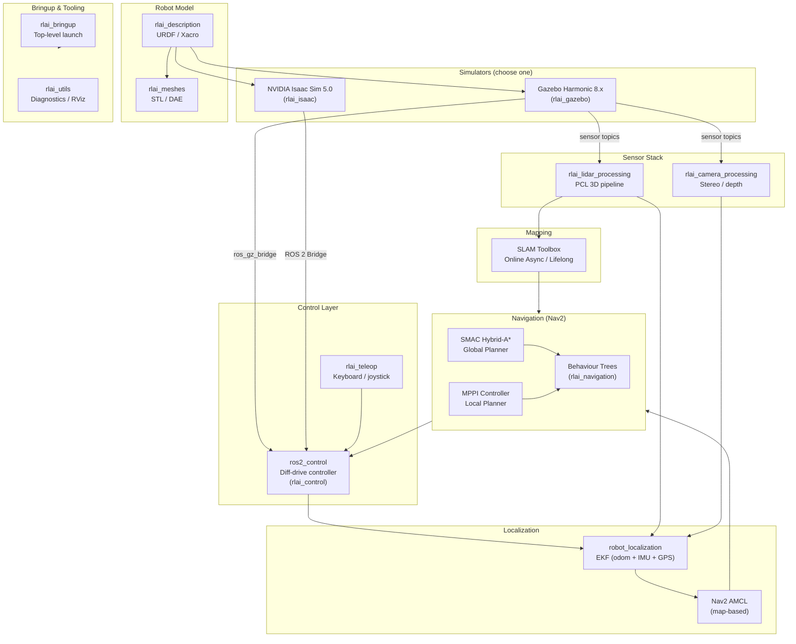

# System Architecture Overview

This document describes the top-level architecture of **rbot** — a full-stack AMR simulation platform built on ROS 2 Jazzy Jalisco.

---

## Package Map

```
src/
├── robot/           rlai_description   — URDF/Xacro robot model
│                    rlai_meshes        — STL/DAE mesh assets
├── simulation/      rlai_gazebo        — Gazebo Harmonic worlds & launch
│                    rlai_isaac         — Isaac Sim USD assets & Python bridge
├── control/         rlai_control       — ros2_control config & controllers
│                    rlai_teleop        — Keyboard / joystick teleoperation
├── perception/      rlai_lidar_processing   — PCL 3D point-cloud pipeline
│                    rlai_camera_processing  — Stereo disparity & depth
├── localization/    rlai_localization  — EKF + AMCL launch & config
├── mapping/         rlai_mapping       — SLAM Toolbox launch & config
├── navigation/      rlai_navigation    — Nav2 launch, params, behaviour trees
├── bringup/         rlai_bringup       — Top-level launch entry points
└── utils/           rlai_utils         — Diagnostics, benchmarks, RViz helpers
```

---

## System Diagram



---

## Data Flow Summary

| Signal | Source | Sink |
|---|---|---|
| `/odom` | ros2_control diff-drive | robot_localization EKF |
| `/imu/data` | Gazebo IMU plugin | robot_localization EKF |
| `/fix` (GPS) | Gazebo NavSat plugin | robot_localization EKF |
| `/scan` | 2D lidar | Nav2 costmaps, AMCL |
| `/points` | 3D lidar | PCL pipeline → costmaps |
| `/depth/image` | Depth camera | camera processing |
| `/map` | SLAM Toolbox | Nav2 global planner |
| `/tf` (map→odom→base_link) | EKF + SLAM Toolbox | all consumers |
| `/cmd_vel` | Nav2 MPPI controller | ros2_control |

---

## Simulator Interoperability

Both simulators share the same ROS 2 topic interface. The only swap is the bridge layer:

| | Gazebo Harmonic | Isaac Sim 5.0 |
|---|---|---|
| Bridge | `ros_gz_bridge` | Isaac ROS bridge |
| World format | SDF 1.11 | OpenUSD |
| Sensor data | Gazebo sensor plugins | Isaac sensor prims |
| Physics | DART / Bullet | NVIDIA PhysX |
| GPU required | No | Yes (RTX) |

---

## Key Configuration Files

| File | Purpose |
|---|---|
| `src/simulation/rlai_gazebo/worlds/small_warehouse.sdf` | Primary simulation world |
| `src/control/rlai_control/config/controllers.yaml` | ros2_control hardware config |
| `src/localization/rlai_localization/config/ekf.yaml` | EKF filter config |
| `src/navigation/rlai_navigation/params/nav2_params.yaml` | Nav2 planner / controller params |
| `src/mapping/rlai_mapping/config/slam_toolbox.yaml` | SLAM Toolbox config |
| `docker/docker-compose.yml` | Multi-service simulation orchestration |

---

*For sensor specifications, see [docs/sensors/](../sensors/).*  
*For step-by-step tutorials, see [docs/tutorials/](../tutorials/).*
